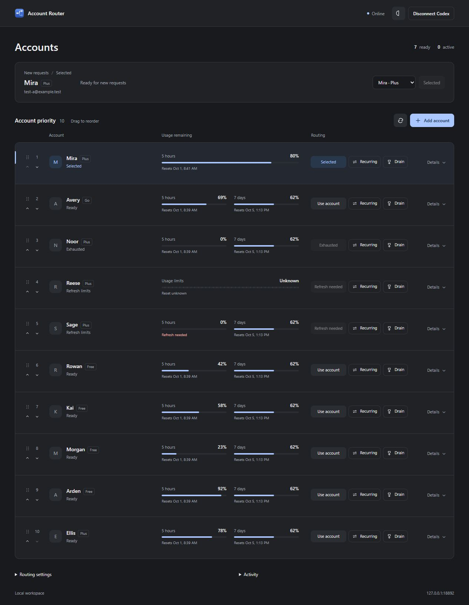

# Account Router

A local Windows account switcher for **Codex**. Two-column account grid, usage meters, account priority, recurring use, and saved resets.



## Setup

1. Install and open [Codex for Windows](https://openai.com/codex/).
2. Download and run [Account Router Setup.exe](https://github.com/Vinayak1337/account-router/releases/latest).
3. Open **Account Router**. Choose **Add account** and complete OpenAI sign-in. Repeat for your other accounts.
4. Choose **Connect to Codex**, reopen Codex, then start a new chat.

Keep Account Router running while using Codex. Closing its window leaves it in the system tray; **Quit** waits for active requests. **Disconnect Codex** restores your previous default provider. Existing chats retain their saved provider.

## Controls

| Control             | Effect                                                                                                                       |
| ------------------- | ---------------------------------------------------------------------------------------------------------------------------- |
| Account toggle      | Turns an account off for new requests and all automatic routing. Active requests finish; priority and settings are retained. |
| Use account         | Changes new requests; active requests finish where they started.                                                             |
| Drag / arrows       | Sets fallback priority, independent of your current selection.                                                               |
| Drain               | When selected: use to 0%, switch away, use a saved reset, then return.                                                       |
| Recurring           | Highest-priority ready recurring account takes over new requests.                                                            |
| Refresh             | Reads usage, plan information, and saved resets.                                                                             |
| Details → Use reset | Selects the earliest supported, unexpired reset first. Confirmation required.                                                |

Unknown or exhausted accounts cannot be selected. Default cutoff: **1% remaining**. **Drain is off by default.** Enabling it authorizes automatic saved resets for that account. Plan expiry appears when OpenAI reports it. Model access depends on the account; experimental Sol-on-Free routing is **off** in new installs.

### Drain

Enable **Drain** on an account, then select it (or let normal routing select it). It takes precedence over recurring and model routing without changing priority.

**0% → next ready account → earliest-expiring reset → return after confirmed recovery.** Repeat until no usable resets remain, then continue normal routing. Active streams finish on their original account before its reset. New requests use fallback accounts immediately; if none are ready, they receive an unavailable response and can retry.

A newer manual selection or disabling Drain cancels the automatic return. An already-submitted reset can still complete. Failed, unconfirmed, or interrupted reset cycles pause Drain instead of spending another credit; check **Details**, retry the same pending reset if needed, then toggle Drain off/on to re-arm. Existing response IDs remain tied to their original account.

## Local data

Sign-ins and settings stay in `%USERPROFILE%\.account-router`. On upgrade, the app copies data from `%USERPROFILE%\AppData\Local\Account Router` once. Windows access is restricted to your user and SYSTEM. The proxy binds to `127.0.0.1`; the dashboard never receives tokens. No cloud dashboard, analytics, or prompt logging.

This is an unofficial Codex utility. It does not modify the ChatGPT website or turn subscriptions into API credits. OpenAI sign-in and service endpoints are required and may change. The installer is unsigned; Windows may show a publisher warning.

## Build

Windows x64 · Node 22+

```powershell
npm ci
npm test
npm start
npm run build:win
```

Installer: `dist/Account-Router-1.2.5-Setup.exe`. `npm run preview` opens an isolated fixture at `http://127.0.0.1:18892/dashboard`; it uses synthetic accounts and never calls OpenAI.

To preview frontend edits against the running app without restarting it, run `npm run preview:live` and open `http://127.0.0.1:18893/dashboard`. This browser view uses your real accounts and controls; keep the app running.

To reuse an existing router directory, launch `"Account Router.exe" --data-dir "C:\path\to\router"`. Run only one router per account store. Never commit `accounts`, `.runtime`, or `router.config.json`.

## Structure

`router.mjs` handles requests; routing, recurring selection, saved resets, dashboard API, desktop integration, and frontend components live in separate modules. See [design notes](docs/design.md) and [security](SECURITY.md).
